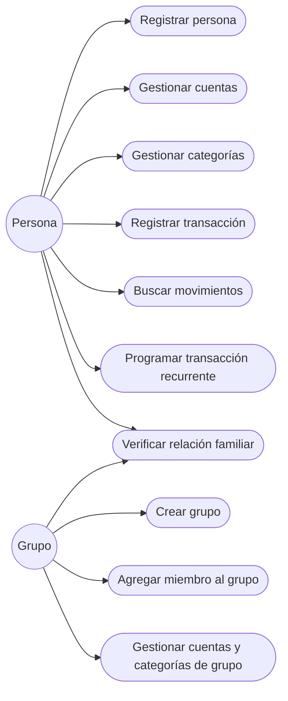
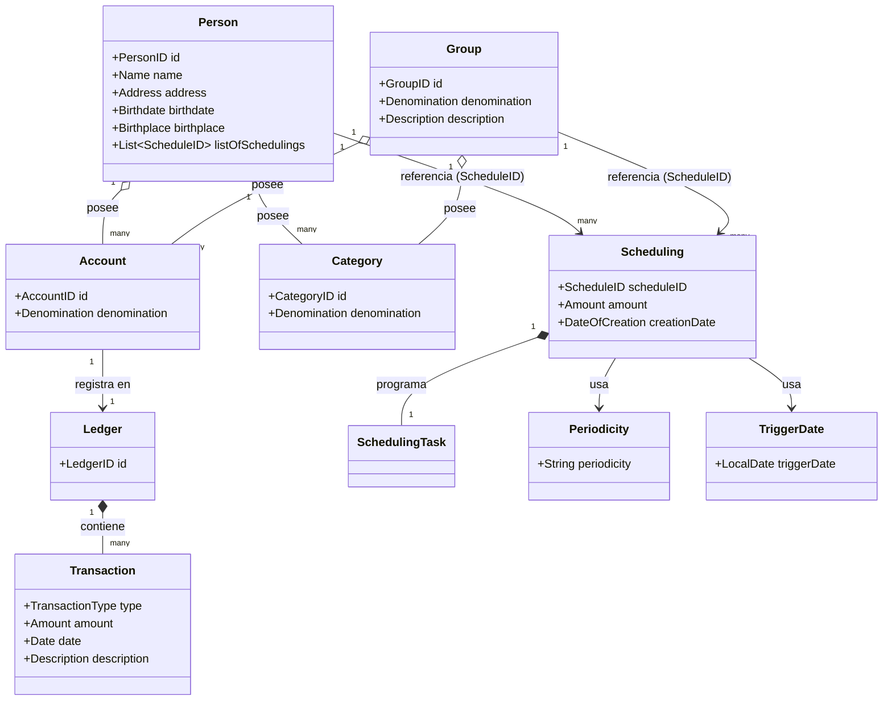
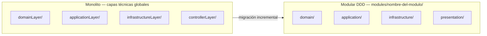
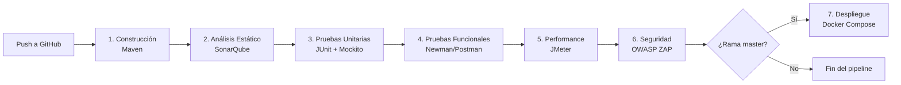

# Personal Finance Management — Proyecto Final Ingeniería de Software II

## Equipo de trabajo

| Integrante | Módulo(s) a cargo |
|---|---|
| Barreros Rodríguez, Olga Angélica | Pruebas funcionales (Postman/Newman), performance (JMeter) y seguridad (OWASP ZAP) |
| Morales Huanca, Jossein | Refactoring (`CreatePersonService`, `CreatePersonTransactionControllerREST`) y análisis estático (SonarQube) |
| Paredes Hallasi, Karoline | Rediseño del módulo Scheduling a DDD (issue #29) + fix de seguridad en tests |
| Reinoso Bengoa, Joel Andrés | Pipeline CI/CD (Jenkins), Docker, y migración DDD de Group/Ledger/Account/Category |

---

## Índice

1. [Propósito del proyecto](#propósito-del-proyecto)
2. [Funcionalidades](#funcionalidades)
3. [Modelo de Dominio](#modelo-de-dominio)
4. [Visión general de arquitectura](#visión-general-de-arquitectura)
5. [Módulos y servicios REST](#módulos-y-servicios-rest)
6. [Pipeline CI/CD](#pipeline-cicd)
7. [Gestión de tareas](#gestión-de-tareas)
8. [Cómo correr el proyecto](#cómo-correr-el-proyecto)

---

## Propósito del proyecto

**Personal Finance Management** es una aplicación web para la gestión de finanzas personales y grupales. Permite a
las personas registrar cuentas, categorías de gasto/ingreso y transacciones, así como organizar grupos (por ejemplo,
un grupo familiar) donde varios integrantes comparten cuentas, categorías y transacciones conjuntas. Además, soporta
la programación de transacciones recurrentes (pagos periódicos) mediante el módulo de *Scheduling*.

El proyecto evoluciona un sistema previamente desarrollado en el curso, aplicando un rediseño hacia una
**arquitectura modular basada en Domain-Driven Design (DDD)** y la implementación de un **pipeline de
Integración y Despliegue Continuo (CI/CD)**.

> _[Completar con 2-3 líneas adicionales sobre el problema real que resuelve y para quién — por ejemplo,
> "orientado a grupos familiares o compañeros de cuarto que necesitan repartir gastos"]_

---

## Funcionalidades



- **Gestión de Personas:** registro de personas, cuentas personales, categorías personales y transacciones
  personales; búsqueda de movimientos por cuenta.
- **Gestión de Grupos:** creación de grupos, incorporación de personas a un grupo, cuentas y categorías de grupo,
  transacciones de grupo, búsqueda de movimientos por período.
- **Verificación de relaciones:** comprobación de si dos personas son hermanas (siblings) y si dos grupos son
  familiares entre sí.
- **Programación de transacciones (Scheduling):** creación de transacciones recurrentes con periodicidad
  (diaria, semanal, mensual, días hábiles).

---

## Modelo de Dominio



| Módulo | Tipo | Entidades / Value Objects principales |
|---|---|---|
| `modules/person` | Aggregate | `Person` (raíz), `PersonID`, `Name`, `Address`, `Birthdate`, `Birthplace` |
| `modules/group` | Aggregate | `Group` (raíz), `GroupID` |
| `modules/ledger` | Aggregate | `Account`, `Category`, `Ledger` (raíz), `Transaction`, `AccountID`, `CategoryID`, `LedgerID` |
| `modules/scheduling` | Aggregate | `Scheduling` (raíz), `SchedulingTask`, `Periodicity`, `TriggerDate`, `ScheduleID` |

**Value Objects compartidos** (`vosShared`): `Amount`, `Date`, `DateOfCreation`, `Denomination`, `Description`,
`Email`, `TransactionType`, `Type`.

**Relaciones entre agregados:** `Person` y `Group` referencian `Scheduling` mediante `ScheduleID` (por identidad,
no por objeto completo), siguiendo el patrón de contextos delimitados de DDD.

---

## Visión general de arquitectura

El proyecto sigue una migración incremental desde una arquitectura monolítica en capas técnicas
(`domainLayer`, `dataModel`, `controllerLayer`, `applicationLayer`, `infrastructureLayer`) hacia una
**arquitectura modular DDD**, donde cada módulo de negocio (carpeta `modules/<nombre>`) agrupa sus propias
capas internas:



```
modules/
 └── <nombre-del-módulo>/
      ├── domain/           # Entidades, Value Objects, interfaces de repositorio
      ├── application/      # Servicios de aplicación (casos de uso)
      ├── infrastructure/   # Implementación de repositorios (JPA / en memoria)
      └── presentation/     # Controllers REST
```

**Módulos migrados a la nueva estructura:**
- ✅ `modules/person` — capas completas (domain, application, infrastructure, presentation)
- ✅ `modules/scheduling` — capas domain e infrastructure (issue [#29](../../issues/29), PR [#30](../../pull/30))
- ✅ `modules/group` — capas completas (domain, application, infrastructure, presentation)
- ✅ `modules/ledger` — agrupa `Account`, `Category`, `Ledger` y `Transaction` (domain, infrastructure)

**Hallazgos de la revisión manual de código** (complementarios al análisis de SonarQube):
- Los Value Objects `Periodicity` y `TriggerDate` existen en el dominio de `Scheduling` pero no se usan
  consistentemente (se manejan como `String`/`LocalDate` sueltos en `Scheduling` y `SchedulingTask`).
- El agregado `Scheduling` acopla lógica de dominio con infraestructura de concurrencia
  (`ScheduledExecutorService`), lo que además hace que sus pruebas tarden ~44s por depender de tiempos reales.
- Varias clases serializables no definen `serialVersionUID` (advertencia recurrente del compilador).
- Se detectó y corrigió un archivo `SecurityConfig` duplicado en `src/test/java` que interfería con la
  autenticación de los tests de integración.

---

## Módulos y servicios REST

> _[Documentar cada módulo en formato OpenAPI/Swagger. A continuación, un punto de partida con los
> controllers REST identificados en el código fuente — completar método HTTP, parámetros y modelos de
> entrada/salida (DTOs) para cada uno.]_

### Módulo: Person
**Propósito:** gestión de personas, sus cuentas, categorías y transacciones personales.

| Endpoint (controller) | Método | Modelo (DTO) |
|---|---|---|
| `CreatePersonControllerREST` | POST | `CreatePersonDTO` / `PersonDTO` |
| `CreatePersonAccountControllerREST` | POST | `CreatePersonAccountDTO` |
| `CreatePersonCategoryControllerREST` | POST | `CreatePersonCategoryDTO` |
| `CreatePersonTransactionControllerREST` | POST | `CreatePersonTransactionDTO` |
| `PersonSearchAccountRecordsControllerREST` | GET | `PersonSearchAccountRecordsInDTO` / `...OutDTO` |

### Módulo: Group
**Propósito:** gestión de grupos, miembros, cuentas y transacciones grupales.

| Endpoint (controller) | Método | Modelo (DTO) |
|---|---|---|
| `CreateGroupControllerREST` | POST | `CreateGroupDTO` / `GroupDTO` |
| `AddPersonToGroupControllerREST` | POST | `AddPersonToGroupDTO` |
| `CreateGroupAccountControllerREST` | POST | `CreateGroupAccountDTO` |
| `CreateGroupCategoryControllerREST` | POST | `CreateGroupCategoryDTO` |
| `CreateGroupTransactionControllerREST` | POST | `CreateGroupTransactionDTO` |
| `GroupSearchAccountRecordsControllerREST` | GET | `GroupSearchAccountRecordsInDTO` |

### Módulo: Otros (relaciones)
| Endpoint (controller) | Método | Modelo (DTO) |
|---|---|---|
| `CheckSiblingsControllerREST` | GET | `CheckIfSiblingsDTO` |
| `CheckGroupsFamilyControllerREST` | GET | `GroupsThatAreFamilyDTO` |

> _[Se recomienda generar la documentación interactiva con springdoc-openapi / Swagger UI, disponible en
> `/swagger-ui.html` una vez levantado el backend, y enlazarla aquí]_

---

## Pipeline CI/CD

Implementado con **Jenkins** ([`Jenkinsfile`](./Jenkinsfile)), disparado automáticamente por cada `push` al
repositorio (`githubPush()`). Etapas:



| Etapa | Herramienta | Detalle |
|---|---|---|
| 1. Construcción Automática | Maven (`./mvnw`) | `clean package` — compilación, gestión de dependencias y empaquetado del `.jar` |
| 2. Análisis Estático | SonarQube | `sonar:sonar` vía `withSonarQubeEnv` |
| 3. Pruebas Unitarias | JUnit 5 + Mockito | `./mvnw test`, reporte publicado con `junit '**/target/surefire-reports/*.xml'` |
| 4. Pruebas Funcionales | Newman (Postman) | Corre la colección `backend/src/test/resources/finance-api-tests.json` contra la app levantada |
| 5. Pruebas de Performance | JMeter | `backend/src/test/jmeter/performance-test.jmx` |
| 6. Pruebas de Seguridad | OWASP ZAP | `security/zap-scan.sh` (baseline scan) |
| 7. Despliegue | Docker | `docker compose build && docker compose up -d` — solo en la rama `master` |

Más detalle en [`docs/CI-CD.md`](./docs/CI-CD.md).

### Contenerización

- [`backend/Dockerfile`](./backend/Dockerfile) — imagen del backend (Spring Boot)
- [`Dockerfile.frontend`](./Dockerfile.frontend) — imagen del frontend
- [`docker-compose.yml`](./docker-compose.yml) — orquesta backend, frontend y proxy (`docker/nginx.conf`)

---

## Gestión de tareas

El seguimiento del proyecto se realiza mediante **GitHub Issues** y **GitHub Project** (tablero Kanban), con
las siguientes columnas: `TO-DO`, `CURRENT ITERATION`, `IN PROGRESS`, `FIX VALIDATION`, `DONE`.

Las tareas se etiquetan según su tipo:
- **Nuevos requisitos:** historias de usuario o tareas técnicas
- **Mejoras:** refactorizaciones y corrección de code smells
- **Correcciones:** bugs, vulnerabilidades o defectos

Cada tarea se asocia a un *issue* de GitHub y se referencia en los commits correspondientes
(`fix #<número>`), permitiendo trazabilidad completa entre tablero → issue → commit → Pull Request.

> _[Agregar captura del tablero de GitHub Project como evidencia]_

---

## Cómo correr el proyecto

### Con Docker (recomendado)

```bash
docker compose build
docker compose up -d
```

### Localmente (sin Docker)

```bash
cd backend
./mvnw spring-boot:run
```

La aplicación queda disponible en `http://localhost:8080`.

> Usuario de seguridad por defecto (solo entorno de desarrollo, no usar en producción):
> configurado en `backend/src/main/resources/application.properties`.

---

## Bibliografía

- Evans, E. (2003). *Domain-Driven Design: Tackling Complexity in the Heart of Software*.
- Martin, R. C. (2008). *Clean Code: A Handbook of Agile Software Craftsmanship*.
- Martin, R. C. (2017). *Clean Architecture: A Craftsman's Guide to Software Structure and Design*.
- Fowler, M. (2018). *Refactoring: Improving the Design of Existing Code*.
- Newman, S. (2019). *Monolith to Microservices: Evolutionary Patterns to Transform Your Monolith*. O'Reilly Media.
